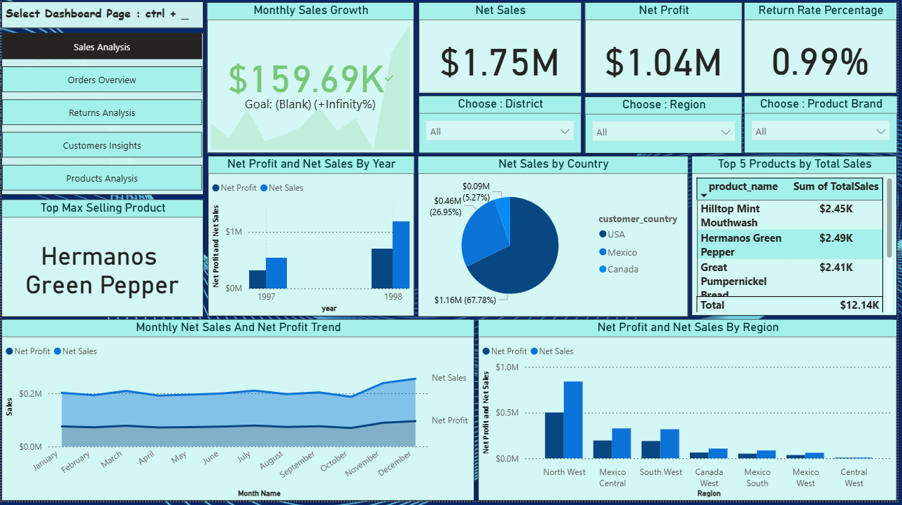
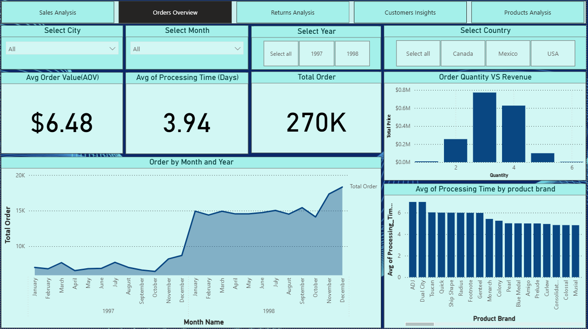
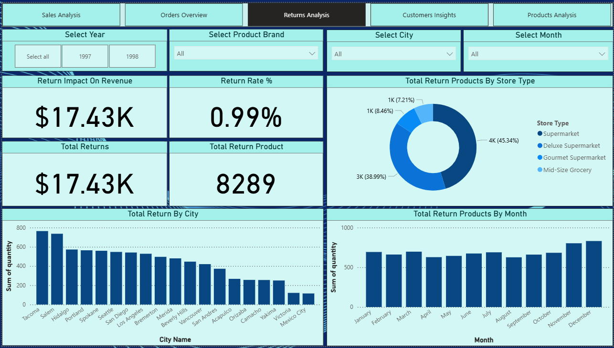
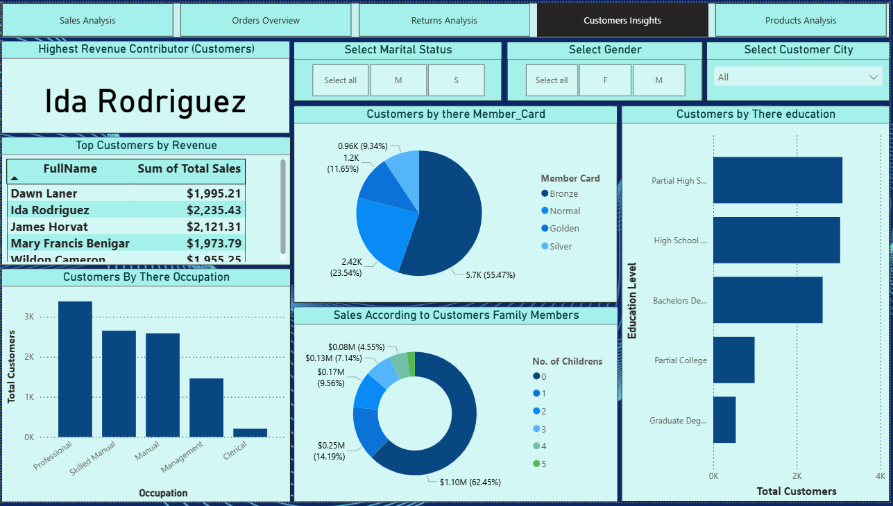

# 📊 Maven Market Multi-Page Power BI Dashboard  

## 🚀 Project Overview  
The **Maven Market Multi-Page Power BI Dashboard** is an interactive and visually rich business intelligence project built using **seven datasets**. It provides a **360-degree analysis** of sales, orders, returns, customers, and products.  
This dashboard helps uncover **hidden patterns**, supports **data-driven decisions**, and enables **business performance optimization** through powerful insights.

---

## 🎯 Objectives  
The main objective is to create a **comprehensive Power BI dashboard** that delivers actionable insights across multiple business areas.

### 1️⃣ Sales Analysis Page  
- Visualize sales trends over time (monthly, yearly).  
- Analyze sales performance by region, product category, and customer segments.  
- Identify top-selling products and their contribution to revenue.  

### 2️⃣ Orders Overview Page  
- Display order fulfillment metrics (processing time, shipping duration, etc.).  
- Evaluate order volume trends and patterns.  
- Analyze the relationship between order size and revenue.  

### 3️⃣ Returns Analysis Page  
- Visualize return rates and reasons for returns.  
- Explore return trends by product, customer type, or geographical location.  
- Assess the impact of returns on overall revenue and customer satisfaction.  

### 4️⃣ Customers Insights Page  
- Segment customers based on membership cards, occupation, and education.  
- Analyze customer retention and churn patterns.  
- Identify high-value customers and their impact on sales.  

### 5️⃣ Products Analysis Page  
- Categorize products by sales volume and profitability.  
- Identify slow-moving or high-margin products for optimization.  
- Visualize product performance across regions and customer segments.  

---

## 📂 Dataset Description  
This dashboard is based on **7 datasets** containing key business information:  

1. **MavenMarket_Customers.csv** – Customer demographics (name, gender, occupation, education, etc.)  
2. **MavenMarket_Products.csv** – Product details (name, brand, cost, retail price, profit margin, etc.)  
3. **MavenMarket_Regions.csv** – Regional and district information  
4. **MavenMarket_Returns_1997-1998.csv** – Returned products with reasons and quantities  
5. **MavenMarket_Stores.csv** – Store details (ID, type, location, etc.)  
6. **MavenMarket_Transactions_1997.csv** – Transaction records for the year 1997  
7. **MavenMarket_Transactions_1998.csv** – Transaction records for the year 1998  

---

## 🖼️ Dashboard Images  

### 📌 1. Sales Analysis Dashboard  
  

### 📌 2. Orders Overview Dashboard  
  

### 📌 3. Returns Analysis Dashboard  
  

### 📌 4. Customers Insights Dashboard  
  

### 📌 5. Products Analysis Dashboard  
  

---

## 🔑 Key Insights  

- ✅ **Top-Selling Product**: *Hermanos Green Pepper* achieved the highest sales revenue.  
- ✅ **Highest Revenue-Contributing Customer**: *Ida Rodriguez* is the top customer by total purchase value.  
- ✅ **Top Margin Product**: *Landslide Sesame Oil* recorded the highest profit margin.  
- ✅ **Return Rate**: Overall return rate is **0.99%**, with supermarkets contributing most returns.  
- ✅ **Sales Growth**: Positive growth trend observed from 1997 to 1998, showing business expansion.  
- ✅ **Customer Segmentation**: Majority of customers hold Bronze member cards and are professionals.  
- ✅ **Profitability Analysis**: High-margin products are key drivers for profitability optimization.  

---

## ✅ Conclusion  
This Power BI dashboard delivers **clear and actionable insights** across various business dimensions.  
It integrates **multiple datasets**, applies **DAX calculations**, and uses **data storytelling** to help businesses make smarter decisions.

💡 *This project showcases advanced Power BI capabilities, data modeling expertise, and effective visualization techniques.*

---

### 🔗 Author  
**Kanhaiya Lal Kumawat**  
📌 *Data Analyst | Power BI Developer | AI Enthusiast*

